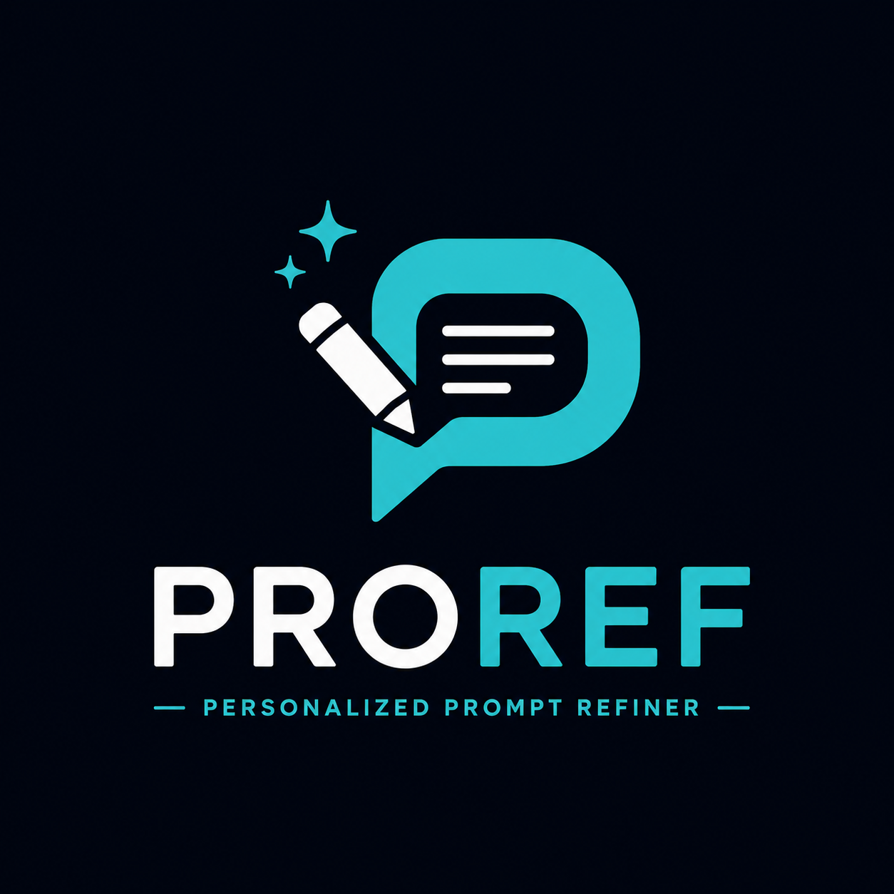
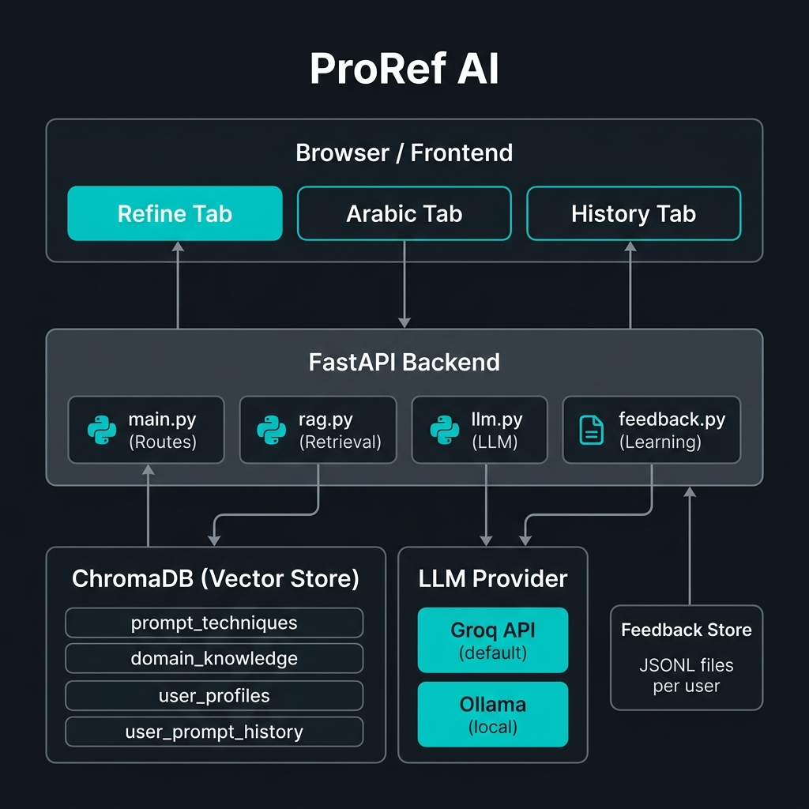

<p align="center">
  
</p>

<h1 align="center">PROREF AI — Personalized Prompt Refiner (v3.0)</h1>

<p align="center">
  <strong>Transform vague prompts into precise, domain-specific, personalized prompts — with domain-specialized AI models and a self-learning feedback loop.</strong>
</p>

<p align="center">
  A RAG-powered web app (v3.0) that retrieves the best prompt-engineering technique and domain-specific best practice for your input, pre-processes context using HuggingFace specialist models, and rewrites your prompt personalized to your profile and expert domain persona.
</p>

<p align="center">
  Built with FastAPI · Pydantic Settings · ChromaDB · Sentence Transformers · HuggingFace Transformers · Tenacity · Groq / Ollama
</p>

---

## What It Does

1. **You create a profile** — your working domain (`dev`, `marketing`, `data_analysis`, `education`, `research`, `creative_writing`), experience level, tone preference, tools, and constraints.
2. **You submit a rough prompt** — in English or Arabic (e.g., *"write me something about marketing"* or *"ساعدني في كتابة واجهة برمجية"*).
3. **Local Arabic Translation** — Arabic prompts are translated locally via `Helsinki-NLP/opus-mt-ar-en` (with LLM fallback).
4. **HuggingFace Signal Extraction** — Domain-specialized HF models (FinBERT, CodeBERT, BART, DistilBERT, GPT-2) analyze your prompt to extract sentiment, code context, financial tone, or condensed intent.
5. **RAG Retrieval** — Retrieves the best prompt-engineering technique and domain best practice, **reranked by historical success rates from user feedback**.
6. **Domain Persona Synthesis** — An LLM rewrites your prompt using a specialized domain persona (e.g., Senior Software Architect, CMO-level Strategist), rendered safely via `app/prompts.py`.
7. **You rate it** 👍 or 👎 — good ratings update technique weights in ChromaDB and **promote validated examples into the knowledge base**.

---

## What's New in v3.0

| Feature | Description |
|---|---|
| **Centralized Config (`app/config.py`)** | Pydantic Settings manages all tunables (temperature, max tokens, timeouts, retries, log levels, vector DB paths, HF models) from `.env`. |
| **Isolated Prompt Engine (`app/prompts.py`)** | Single source of truth for system prompts, user templates, and **Domain Expert Personas** (`dev`, `marketing`, `data_analysis`, `education`, `research`, `creative_writing`). |
| **HuggingFace Specialist Pipelines (`app/hf_pipeline.py`)** | Lazy-loaded HF models pre-process inputs: FinBERT for business tone, CodeBERT for dev context, BART for intent summary/zero-shot, DistilBERT for data sentiment, GPT-2 for creative seeds. |
| **Local Arabic Translation** | Integrated `Helsinki-NLP/opus-mt-ar-en` for fast, offline Arabic-to-English translation (with LLM fallback). |
| **Tenacity Retry & Backoff** | Exponential backoff retries for Groq/Ollama API calls to handle rate limits and transient network timeouts automatically. |
| **Structured Logging (`app/logging_config.py`)** | Rotating log file system (`logs/proref.log`) with colored console logging. Zero unhandled `print()` statements. |
| **Graceful Degradation** | Set `HF_USE_PIPELINE=false` in `.env` to disable HuggingFace pipelines instantly on low-RAM machines. |

---

## Architecture



```
[ User Input (English / Arabic) ]
             │
             ├──> [ Arabic Translation: Helsinki-NLP / LLM Fallback ]
             │
             ├──> [ HF Domain Signals: FinBERT / CodeBERT / BART / DistilBERT ]
             │
             ├──> [ RAG Retrieval: Feedback-Aware Reranked Techniques + Domain Tips ]
             │
             └──> [ LLM Prompt Synthesis with Domain Expert Personas ]
                          │
                          ▼
            [ Refined Prompt + Explanation ]
                          │
                          ▼
            [ 👍/👎 Feedback → ChromaDB Rerank & KB Promotion ]
```

### Endpoints

| Endpoint | Module | Description |
|---|---|---|
| `POST /onboard` | `main.py` → `rag.py` | Stores user profile to disk + ChromaDB |
| `POST /refine` | `main.py` → `rag.py` → `hf_pipeline.py` → `llm.py` | Full RAG + HF signals + LLM refinement pipeline |
| `POST /translate-refine` | `main.py` → `hf_pipeline.py` / `llm.py` → `rag.py` | Local HF Arabic translation + RAG refinement |
| `POST /feedback` | `main.py` → `feedback.py` (background) | Rates a refinement, updates success rates, may promote to KB |
| `GET /history/{user_id}` | `main.py` → `feedback.py` | Returns a user's past refinements with ratings |

---

## Tech Stack

| Layer | Technology | Cost |
|---|---|---|
| Backend | FastAPI + Uvicorn | Free |
| Configuration | Pydantic Settings (`pydantic-settings`) | Free |
| Vector DB | ChromaDB (persistent local) | Free |
| Local Embeddings | `all-MiniLM-L6-v2` via sentence-transformers | Free |
| Specialist Models | HuggingFace Transformers (MarianMT, FinBERT, CodeBERT, BART, DistilBERT, GPT-2) | Free |
| Resilience | Tenacity (exponential backoff retry) | Free |
| LLM | Groq (default) or Ollama (local) | Free |
| Logging | Python `logging` + `colorlog` + rotating file handler | Free |
| Frontend | Vanilla HTML/CSS/JS SPA | Free |

**Total cost to run: $0.** No paid APIs required.

---

## Setup & Run

### 1. Clone & Create Virtual Environment

```bash
git clone https://github.com/xvadel/proref.git
cd proref

python -m venv .venv
# Windows
.venv\Scripts\activate
# macOS/Linux
source .venv/bin/activate
```

### 2. Install Dependencies

```bash
pip install -r requirements.txt
```

> **Note:** Models are downloaded automatically on first use. You can also run with `uv` (`uv pip install -r requirements.txt`).

### 3. Configure Environment

```bash
cp .env.example .env
```

Edit `.env` to customize settings:

```env
# LLM Provider: "groq" or "ollama"
LLM_PROVIDER=groq
GROQ_API_KEY=your_groq_api_key_here
GROQ_MODEL=llama-3.1-8b-instant

# Shared Model Parameters
LLM_TEMPERATURE=0.7
LLM_MAX_TOKENS=1024
LLM_TIMEOUT_SECONDS=60
LLM_MAX_RETRIES=3

# HuggingFace Specialist Models Switch
HF_USE_PIPELINE=true

# Logging Level (DEBUG | INFO | WARNING | ERROR)
LOG_LEVEL=INFO
```

### 4. Run the App

```bash
uvicorn app.main:app --reload
```

Open **http://localhost:8000** in your browser. The knowledge base is automatically ingested on startup, and rotating log entries write to `logs/proref.log`.

---

## API Reference

### `POST /onboard` — Create/Update User Profile

```bash
curl -X POST http://localhost:8000/onboard \
  -H "Content-Type: application/json" \
  -d '{
    "user_id": "alice",
    "domain": "dev",
    "experience_level": "expert",
    "tone_preference": "formal",
    "output_format_preference": "code",
    "interests": ["python", "rag", "fastapi"],
    "tools": ["FastAPI", "Docker", "PostgreSQL"],
    "bio": "Senior AI systems engineer"
  }'
```

**Response:**
```json
{
  "user_id": "alice",
  "domain": "dev",
  "experience_level": "expert",
  "status": "onboarded"
}
```

---

### `POST /refine` — Refine a Raw Prompt

```bash
curl -X POST http://localhost:8000/refine \
  -H "Content-Type: application/json" \
  -d '{ "user_id": "alice", "raw_prompt": "help me write a REST API" }'
```

**Response:**
```json
{
  "refinement_id": "550e8400-e29b-41d4-a716-446655440000",
  "refined_prompt": "You are a senior software engineer...",
  "explanation": "Added tech stack constraints, structured code output, and role persona...",
  "technique_used": "Role / Persona Setting",
  "domain_tip_used": "Specify Tech Stack & Constraints"
}
```

---

### `POST /translate-refine` — Arabic Prompt → Refined English

```bash
curl -X POST http://localhost:8000/translate-refine \
  -H "Content-Type: application/json" \
  -d '{ "user_id": "alice", "arabic_prompt": "ساعدني في كتابة واجهة برمجية" }'
```

**Response:**
```json
{
  "refinement_id": "...",
  "original_arabic": "ساعدني في كتابة واجهة برمجية",
  "translated_english": "Help me write an API",
  "refined_prompt": "You are a senior software engineer...",
  "explanation": "...",
  "technique_used": "Role / Persona Setting",
  "domain_tip_used": "Specify Tech Stack & Constraints"
}
```

---

### `POST /feedback` — Rate a Refinement

```bash
curl -X POST http://localhost:8000/feedback \
  -H "Content-Type: application/json" \
  -d '{
    "refinement_id": "550e8400-e29b-41d4-a716-446655440000",
    "user_id": "alice",
    "rating": "good"
  }'
```

**Response:**
```json
{
  "refinement_id": "550e8400-...",
  "rating": "good",
  "promoted_to_kb": true
}
```

---

### `GET /history/{user_id}` — Refinement History

```bash
curl http://localhost:8000/history/alice?limit=10
```

---

## Project Structure

```
proref/
├── app/
│   ├── __init__.py          # Package init
│   ├── config.py            # Pydantic Settings (centralized configuration)
│   ├── logging_config.py    # Structured rotating file & console logger
│   ├── prompts.py           # Single source of truth for templates & personas
│   ├── hf_pipeline.py       # HuggingFace specialist pipeline registry
│   ├── main.py              # FastAPI application & route declarations
│   ├── models.py            # Pydantic data schemas & validators
│   ├── rag.py               # ChromaDB retrieval & feedback-aware reranking
│   ├── llm.py               # Groq / Ollama client adapters with Tenacity retry
│   └── feedback.py          # Feedback store, success-rate calculation & KB promotion
├── data/
│   ├── prompt_techniques.json
│   ├── promoted_examples.jsonl
│   └── domain_knowledge/
│       ├── dev.json
│       ├── marketing.json
│       ├── data_analysis.json
│       ├── education.json
│       ├── research.json
│       └── creative_writing.json
├── logs/                    # Created at runtime (gitignored)
│   └── proref.log           # Rotating application logs
├── feedback/                # Created at runtime (gitignored)
├── user_profiles/           # Created at runtime (gitignored)
├── chroma_db/               # Created at runtime (gitignored)
├── frontend/
│   ├── index.html           # SPA Frontend UI
│   └── assets/
├── requirements.txt
├── pyproject.toml
├── .env.example
├── .gitignore
└── README.md
```

---

## License

MIT — use it, learn from it, build on it.
